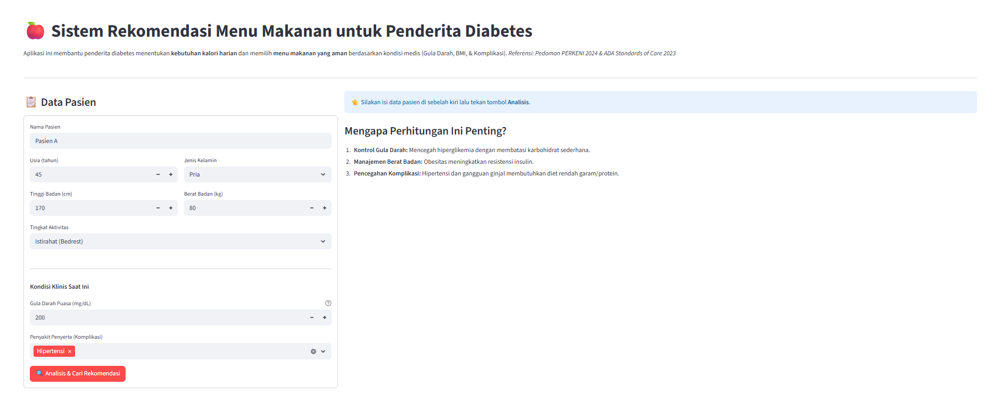
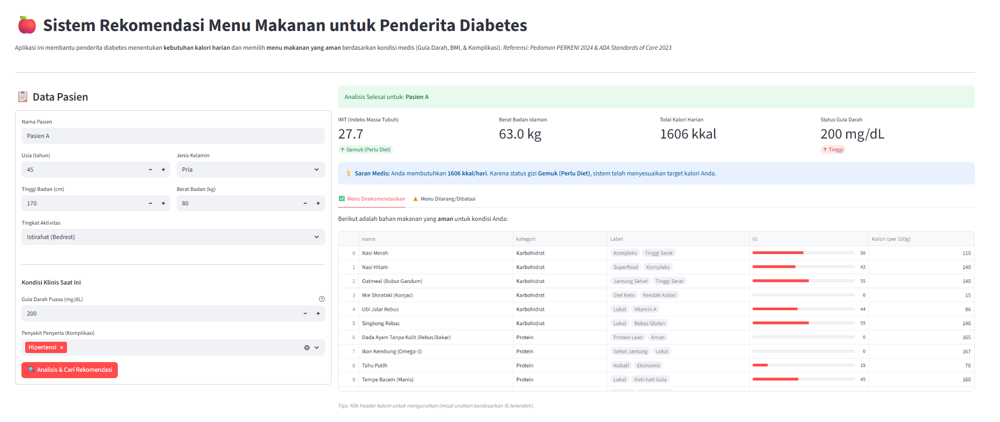
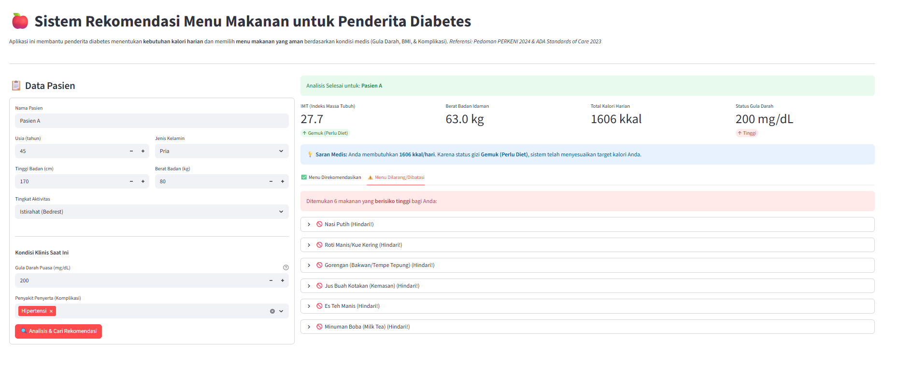

### Final Project Rekayasa Sistem Berbasis Pengetahuan C

### Kelompok 1:

- Achmad Fajri Sudrajab - 5025221104
- Wu Alfred Hardy - 5025221312

# 🍎 Sistem Rekomendasi Menu Makanan untuk Penderita Diabetes

Sistem pakar berbasis web untuk membantu penderita Diabetes Melitus Tipe 2 menentukan kebutuhan kalori harian dan mendapatkan rekomendasi menu makanan yang aman. Sistem ini dibangun menggunakan pendekatan Rule-Based System yang mengacu pada standar medis resmi PERKENI 2024 dan ADA 2023.

## 📸 Dokumentasi







## 🏛️ Arsitektur & Rekayasa Pengetahuan

Sistem ini dirancang menggunakan arsitektur Sistem Pakar yang memisahkan Basis Pengetahuan (Knowledge Base) dengan Mesin Inferensi (Inference Engine).

### 1. Akuisisi Pengetahuan (Knowledge Acquisition)

Pengetahuan dalam sistem ini diekstraksi dari pedoman medis kredibel:

- PERKENI 2024: Pedoman Pengelolaan dan Pencegahan Diabetes Melitus Tipe 2 di Indonesia. Digunakan untuk:

  - Rumus perhitungan Kalori Basal & Total (BBI).

  - Klasifikasi IMT (Asia-Pasifik).

  - Batasan klinis (Gula Darah Puasa, Hipertensi).

- ADA Standards 2023: American Diabetes Association. Digunakan untuk:

  - Manajemen Nutrisi Medis (Indeks Glikemik).

  - Manajemen Lipid (Pembatasan Lemak Jenuh/Trans).

- TKPI & USDA: Basis data nutrisi untuk nilai gizi bahan makanan lokal.

### 2. Representasi Pengetahuan (Knowledge Representation)

Data disimpan dalam struktur terstruktur berbasis JSON (/data/) untuk memudahkan pembaruan tanpa mengubah kode program.

- Fakta Medis: Disimpan dalam medical_rules.json (Contoh: Batas Gula Darah = 140 mg/dL).

- Data Makanan: Disimpan dalam food_database.json dengan atribut:

  - nutrisi: Kalori, Karbo, Protein, Lemak, Natrium.

  - metrik_diabetes: Indeks Glikemik (IG), Kategori IG.

  - tags: Label khusus (misal: "Lemak Jenuh", "Tinggi Serat").

### 3. Mekanisme Inferensi (Inference Mechanism)

Sistem menggunakan metode Forward Chaining (Data-Driven). Sistem memulai dari fakta (Data Pasien) kemudian mencocokkannya dengan aturan (Rules) untuk menghasilkan kesimpulan (Rekomendasi Menu).

- Layer 0 (Safety First): Pengecekan label bahaya mutlak.

  - IF makanan mengandung tag "Minuman Manis" OR "Gorengan" THEN Status = DILARANG (Absolute).

- Layer 1 (Kontrol Glikemik):

  - IF Gula Darah Puasa > 140 mg/dL AND Makanan IG Tinggi (>70) THEN Status = DILARANG.

- Layer 2 (Manajemen Obesitas - Preventif):

  - IF IMT > 25 (Obesitas) AND (Makanan IG Tinggi OR Kalori Snack > 200 kkal) THEN Status = DILARANG (Mencegah Resistensi Insulin).

- Layer 3 (Komplikasi Komorbid):

  - IF Pasien Hipertensi AND Natrium Makanan > 400mg THEN Status = DILARANG.

  - IF Pasien Kolesterol AND Lemak Jenuh Tinggi THEN Status = DILARANG.

- Layer 4 (Rekomendasi):

  - ELSE Status = AMAN (Direkomendasikan).

### 4. Perhitungan Kebutuhan Energi (Calorie Calculation)

Menggunakan Rumus Broca Modifikasi sesuai PERKENI:

- Berat Badan Idaman (BBI): (Tinggi - 100) - 10%.

- Kalori Basal: BBI x 30 (Pria) atau BBI x 25 (Wanita).

- Faktor Koreksi:

  - Usia: -5% per dekade jika usia > 40 tahun.

  - Aktivitas: +10% s.d +50% (Bedrest s.d Berat).

  - Status Gizi: -20% jika Obesitas (untuk defisit kalori).

## 🌟 Fitur Unggulan

### 1. 🧮 Kalkulator Kalori Medis (Medical-Grade)

Menghitung kebutuhan energi secara presisi medis dengan mempertimbangkan usia, gender, aktivitas, dan status gizi untuk menentukan target kalori harian yang realistis.

### 2. 🧠 Inference Engine Cerdas (5-Layer Rules)

Mesin logika yang tidak hanya melihat gula darah, tetapi juga Pencegahan Preventif. Contoh: Pasien dengan gula darah normal tetapi Obesitas tetap akan dilarang mengonsumsi Boba atau Gorengan untuk mencegah resistensi insulin di masa depan (sesuai Asas Kehati-hatian Medis).

### 3. 🍽️ Dynamic Meal Planner

Fitur penyusunan menu harian otomatis yang Cerdas & Realistis:

- Menggunakan algoritma alokasi kalori (Pagi 20%, Siang 40%, Malam 25%, Snack 15%).

- Dynamic Portion Sizing: Mengkonversi porsi makanan ke dalam gram (misal: "150 gr Nasi Merah") agar total kalori menu pas dengan target pasien.

### 4. 🥗 Database Pangan Lokal

Mengutamakan kearifan lokal (Singkong, Tempe Bacem, Ikan Kembung, Ubi) dibandingkan makanan barat, sehingga rekomendasi mudah diterapkan oleh pasien di Indonesia.

### 🚀 Cara Menjalankan (Local)

Ikuti langkah-langkah berikut untuk menjalankan aplikasi di komputer Anda:

### Clone Repositori:

Buka Terminal anda dan jalankan:

```bash
git clone https://github.com/Achmadfajri10/Sistem-Rekomendasi-Menu-Penderita-Diabetes.git
cd Sistem-Rekomendasi-Menu-Penderita-Diabetes
```

### Install Dependencies:

```bash
pip install -r requirements.txt
```

### Jalankan Aplikasi:

```bash
streamlit run app.py
```

(Akses di browser: http://localhost:8501)

## 📂 Struktur File Proyek

```
Sistem-Rekomendasi-Menu-Penderita-Diabetes/
├── data/                     # BASIS PENGETAHUAN
│ ├── food_database.json      # Database Nutrisi & IG (Fakta Objek)
│ └── medical_rules.json      # Parameter Medis (Fakta Aturan)
│
├── modules/ # LOGIKA SISTEM (BACKEND)
│ ├── calorie_calculator.py   # Algoritma Rumus Broca
│ ├── inference_engine.py     # Algoritma Forward Chaining & Filtering
│ ├── data_loader.py          # Fungsi pembaca JSON
│ └── meal_planner.py         # Algoritma Penyusunan Menu & Porsi
│
├── app.py # ANTARMUKA PENGGUNA (FRONTEND)
├── requirements.txt          # Library yang perlu diinstall
└── README.md
```

## 📖 Referensi Utama

Sistem ini dikembangkan berdasarkan studi literatur dari dokumen berikut:

- PERKENI (2024). Pedoman Pengelolaan dan Pencegahan Diabetes Melitus Tipe 2 di Indonesia. Jakarta: PB PERKENI.

- American Diabetes Association (2023). Standards of Care in Diabetes—2023. Diabetes Care, 46(Supplement_1).

- Soelistijo, S. A., et al. (2021). Pedoman Pengelolaan dan Pencegahan Diabetes Melitus Tipe 2 Dewasa di Indonesia 2021. PB PERKENI.

## 🔜 Rencana Pengembangan (Future Work)

[ ] Fitur Defisit Kalori Otomatis: Menghitung target penurunan berat badan spesifik per minggu, dikarenakan menurut pedoman PERKENI 2024 yang menjelaskan bahwa pasien yang mengalami obesitas disarankan untuk menurunkan berat badan.

[ ] Personalisasi Preferensi: Menambahkan filter "Alergi" atau "Kesukaan" (misal: Vegetarian).

<i>Project ini disusun untuk memenuhi Tugas Akhir Mata Kuliah Rekayasa Sistem Berbasis Pengetahuan Kelas C.</i>
